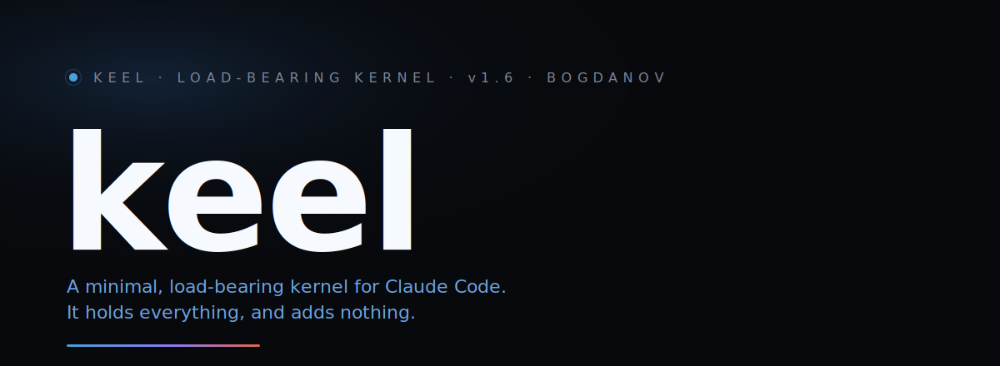

<p align="center">
  
</p>

<p align="center">
  
  
  
  
  
  
</p>

<p align="center">
  <a href="README.md">English</a> · <b>Русский</b>
</p>

---

**Keel** — минимальное несущее ядро для проектов на [Claude Code](https://claude.com/claude-code).
Оно делает агента единственным исполнителем продукта от начала до конца —
идея, архитектура, код, QA, деплой, инфраструктура, безопасность, рынок,
поддержка, расходы — и не добавляет ничего сверх этого.

Родственное ядро: [**Loft**](https://github.com/bogdanov-igor/loft) — та же
философия для документной работы аналитика (ТЗ, wiki-зеркала Confluence,
аудит корпуса). Лофт стоит на киле.

Keel — преемник SkillForge, перестроенный в июле 2026 после аудита того, что
реально помогало, а что было мёртвым грузом. Вердикт аудита одной строкой:
**машинерия перевесила работу.** SkillForge вёз свой MCP-сервер, векторный
индекс, реранкер и восемь агентов-персон — а его же лучший релизный паттерн
предписывал агентам всё это обходить и просто грепать файлы. Keel — это тот
самый обход, возведённый в архитектуру.

→ [**Что изменилось, в замерах**](docs/ru/why-keel.md) — честное сравнение:
всегда загруженный контракт в 3,6 раза меньше, кода ядра в 3,7 раза меньше,
ноль рантайм-сервисов там, где предшественнику нужно было два, и удалён ровно
тот компонент, который OOM-убил живой прод-стейдж.

## Быстрый старт

**1.** Скачайте `keel_1.6.0.tgz` и `keel_1.6.0.tgz.sha256` из
[Releases](https://github.com/bogdanov-igor/keel/releases/latest) в папку проекта.

**2.** Откройте проект в Claude Code и скажите:

> Установи keel из архива в этой папке: сверь sha256, распакуй, запусти
> `keel/install.sh` и расскажи, что появилось.

**3.** Если проект жил под SkillForge — или под любой системой до этой — скажите:

> Почисти остатки старой системы и предложи переаудит.

Это вся установка. Claude сам сверит контрольную сумму, распакует, поставит и
отчитается; шаг очистки уводит машинерию предшественника в карантин (ничего не
удаляя) и заводит переаудит в `BACKLOG.md`.

Единственная опциональная зависимость — Playwright для браузерного QA
(`npx playwright install chromium`).

### Или руками

```sh
cd /path/to/project                    # сюда скопированы tgz + .sha256
shasum -c keel_1.6.0.tgz.sha256        # сначала целостность: ждём "OK"
tar -xzf keel_1.6.0.tgz
bash keel/install.sh                   # без аргумента = ставим прямо здесь
```

Из репозитория-исходника: `bash install.sh /path/to/project`.

**Обновление — та же команда.** Забираете свежий keel, снова запускаете
`install.sh`: файлы ядра заменяются, состояние проекта не трогается, а скиллы,
которые вы написали сами, переносятся автоматически. Keel сам скажет, что вышло
обновление — одна строка при старте сессии, раз в сутки, и полная тишина, если
у вас актуальная версия.

## Что это

- **Один всегда загруженный контракт** — [`.claude/CLAUDE.md`](bundle/.claude/CLAUDE.md),
  81 строка. Всё остальное подгружается только при использовании.
- **37 скиллов с ленивой загрузкой** — 7 базовых (`stage`, `qa-browser`,
  `audit`, `remember`, `recall`, `safe-dev-server`, `migrate`) плюс 30 доменных:
  инженерия, devops, рост, копирайт, исследования.
- **`OPS.md` — доска дежурств.** Постоянные обязанности с периодичностью,
  каждая привязана к скиллу. Два режима: `build` (никаких плановых сжиганий
  токенов) и `live` (решение владельца о go-live: cron, полная периодичность).
  Именно это превращает end-to-end ownership из декларации в маршрутизируемую
  работу.
- **2 сабагента** — `scout` (разведка только на чтение) и `verifier`
  (независимый судья). Декомпозиция по изоляции контекста, а не по должностям.
- **3 хука** — страж утечки секретов, предохранитель от форк-бомбы dev-сервера
  (оба заслужили место, остановив реальные инциденты) и тихая проверка
  обновлений.
- **Файловая память, привязанная к коду** — заметки в `memory/` со строгим
  однострочным индексом плюс якоря, которые делают урок достижимым *из того
  файла, о котором он* (скилл `recall`). `BACKLOG.md` как единственная очередь
  работ, `PARKED.md`, чтобы заблокированное владельцем парковалось, а не гнило.

## Чего здесь намеренно нет

- **Ни своего MCP-сервера, ни векторного индекса, ни эмбеддингов, ни
  реранкера.** Несколько сотен markdown-заметок находятся чтением индекса и
  grep'ом. Собственный eval предшественника насытился на recall@5 = 1.0 на
  золотом наборе из **шести запросов** — а его демон эмбеддингов OOM-убил живой
  стейдж на середине фан-аута, потеряв работу трёх сабагентов. Ноль своей
  инфраструктуры = ноль этого.
- **Никаких агентов-персон.** Ролевые сабагенты тратят на координацию больше
  токенов, чем на работу.
- **Никакой церемонии на каждую задачу.** Ни прогонов, ни цитирования гипотез,
  ни файловых локов, ни sha256-сайдкаров. Малая работа не создаёт файлов;
  большая создаёт два — бриф и проверенный отчёт.
- **Ни апдейтера, ни системы патчей.** Копируете папку — вот и вся дистрибуция.

## Код ↔ знание

Память заземлялась **по симптому**: грепнуть и надеяться. По **месту** — никак. В
живой памяти проекта из 222 заметок код называют 141 — 494 упоминания, 237
уникальных файлов, — и со стороны кода не достижимо ничего из этого. Спросить «что
проект знает про `apps/web/proxy.ts`?» *до* того, как его откроешь, было нельзя.

Новое в 1.5.0 — скилл **`recall`**. Заметка объявляет код, о котором она, прямо во
front-matter:

```yaml
code:
  - apps/web/proxy.ts#handleRequest
  - apps/web/middleware.ts
```

Дальше — два запроса, ни индекса, ни демона, ни шага сборки:

```sh
bash .claude/skills/recall/anchors.sh apps/web/proxy.ts   # что мы знаем про этот код
bash .claude/skills/recall/anchors.sh --check             # мёртвые якоря
```

Результат приходит двумя наборами. **ANCHORED** — заметки, объявившие этот код во
front-matter: точно и проверяемо. **MENTIONED** — заметки, которые лишь называют
его в прозе, ранжированные по плотности упоминаний: полезно, шумно и непроверяемо —
что и есть аргумент в пользу якорей.

**`--backfill` навешивает эти якоря на заметку, которая у вас уже есть.**
`bash .claude/skills/recall/anchors.sh --backfill` сверяет каждое упоминание кода
в прозе с реальным деревом и навешивает якорь только там, где имя разрешается ровно
в один файл: `apps/web/proxy.ts` из заметки становится `shippulse/apps/web/proxy.ts`,
когда монорепозиторий держит приложение в подкаталоге. Неоднозначное и неразрешимое
докладываются, но не угадываются: угаданный путь — это мёртвый якорь, изготовленный
на пустом месте. По умолчанию — сухой прогон; `--apply` пишет front-matter и
пропускает заметки, которые уже объявили свой код.

Смысл именно в **обнаружении гнили**. Переименуйте символ или удалите файл — и
`--check` доложит `DEAD_SYMBOL` / `DEAD_FILE`. Упоминание в прозе не проверишь
никогда. Переименование и удаление прогнаны end-to-end: пойманы оба.

**Рёбра код→код здесь не строятся.** Вызывающих, ссылки и иерархию вызовов точно и
вживую считает serena (LSP, уже засеяна в `.mcp.json`): `find_symbol`,
`find_referencing_symbols`. Структура кода, поддерживаемая руками, гниёт; LSP — нет.
Слой якорей везёт ровно то, чего LSP знать не может: что мы *узнали* про это место
в коде.

Правило 2 контракта туда и маршрутизирует: «прежде чем менять файл, который вы не
только что написали, заземлитесь по месту: скилл `recall`». Отсюда и рост контракта
с 79 строк до 81: скилл, к которому никто не маршрутизирует, — это скилл, которым
никто не пользуется. Ровно так умер каталог скиллов предшественника.

### Гигиена памяти

Граф «заметка → заметка» остался на месте: **рёбра — это `[[wikilinks]]` в
заметках**, там же, где были всегда. На живой памяти проекта — 919 рёбер, 0 битых
ссылок, 4 сироты.

```sh
bash .claude/skills/memory-consolidation/graph.sh    # хабы, битые ссылки, сироты
```

Это гигиена памяти — и ничего сверх того. (`memory/` — markdown с `[[wikilinks]]`,
так что папка открывается в Obsidian или VS Code Foam; это картинка, а не
инструмент.)

Граф SkillForge был таким же — заметка → заметка, про код он не знал ничего. И
источником правды он тоже не был: он *пересобирал* граф из тех же ссылок в тех же
файлах на каждом поиске, а потом гонял по нему персонализированный PageRank
(«HippoRAG-lite») как множитель-бустер `1 + 0.2 * graph` поверх
`0.8 * vector + 0.2 * keyword`. **Keel выбросил именно скорер, а не граф** — и
польза скорера так и не была показана: поисковый стек упёрся в потолок
recall@5 = 1.0 на золотом наборе из шести запросов, а на потолке заслугу графового
слагаемого не отделить ни от какого другого.

→ [Архитектура](docs/ru/architecture.md) — подробнее.

## Тесты

У скриптов ядра есть собственный набор тестов — `test/run.sh`, обычные
bash-ассерты поверх `anchors.sh`, `graph.sh`, `sweep.sh` и `update-check.sh`,
прогон офлайн на одноразовых фикстурах. `build-archive.sh` запускает его первым
делом и отказывается собирать релиз, если хоть что-то упало, — скрипт, не
прошедший собственный тест, в релиз не попадает. Набор существует потому, что
в каждом из последних трёх релизов эти скрипты уходили с реальным багом, который
ловила только придирчивая ручная вычитка: `--check` не замечал переименование
`handleRequest`→`handleRequestV2`, потому что `grep -F` ищет подстроку;
`MENTIONED` ранжировался по числу совпавших строк, а не упоминаний. Набор
фиксирует ровно эти случаи, чтобы они не вернулись. Это инструмент мейнтейнера,
а не то, что устанавливается в ваш проект.

## Раскладка в развёрнутом проекте

```text
.claude/    ядро (принадлежит ядру: переустановка перезаписывает)
memory/     память проекта: индекс MEMORY.md + lessons/antipatterns/patterns
stages/     артефакты большой работы: NNN-slug/brief.md + report.md
BACKLOG.md  единственная каноническая очередь работ
PARKED.md   заблокированное владельцем, с планом возобновления
OPS.md      постоянные дежурства + режим (build/live) + реестр доступов
keel.json   пороги предохранителя, настройки проверки обновлений
.mcp.json   внешние MCP-серверы (засеяны serena + context7)
```

## Переходите со SkillForge?

Поставьте Keel и запустите скилл **`migrate`**. Он отправляет машинерию
предшественника — бандл, MCP-запись, агентов-персон, скиллы-призраки — в
карантин `.keel-migration/<метка времени>/` с манифестом восстановления,
**ничего не удаляет**, не трогает вашу память, стейджи, бэклог и ваши
собственные скиллы, а всё двусмысленное помечает, оставляя решение вам. После
этого предлагает переаудит — потому что ядро сменилось под кодовой базой, чьи
прежние гейты, по её же собственным записям, регулярно обходились.

→ [Руководство по миграции](docs/ru/migration.md)

## Документация

| | Русский | English |
|---|---|---|
| Установка и обновление | [установка](docs/ru/install.md) | [install](docs/en/install.md) |
| Архитектура | [архитектура](docs/ru/architecture.md) | [architecture](docs/en/architecture.md) |
| Миграция со SkillForge | [миграция](docs/ru/migration.md) | [migration](docs/en/migration.md) |
| Что изменилось, в замерах | [почему keel](docs/ru/why-keel.md) | [why-keel](docs/en/why-keel.md) |

## Лицензия

[Apache-2.0](LICENSE) © 2026 **Игорь Богданов** · <bogdanov.ig.alex@gmail.com>

Можно свободно использовать, форкать и строить поверх — в том числе
коммерчески. Сохраните указание авторства и укажите, что вы изменили.
