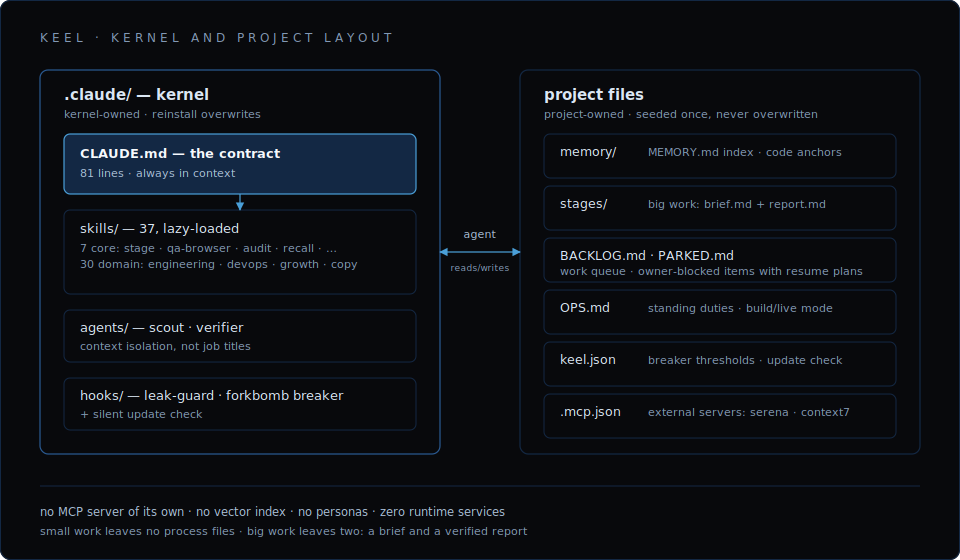

# Architecture

Keel is built on one idea: files are the only shared truth, and the agent is
the orchestrator. Everything below follows from that.



## The contract

[`.claude/CLAUDE.md`](../../bundle/.claude/CLAUDE.md) — 81 lines, always in
context, and the only thing that always is. It fixes two things.

Ownership. The agent is the sole executor of the product end to end. There
is no director, PM, analyst, tester, accountant or ops crew behind it. It
invents, architects, builds, verifies, ships, operates, supports, markets
and manages spend. The owner is the customer: grants access, sets direction,
reads reports. A user complaint, an error in the logs, an unhardened port —
each of these the agent is expected to notice, queue and fix without being
asked.

Ten working rules. Two tiers of work; ground in memory before acting — by
symptom through the index, and by location in the code before changing a
file you did not just write; done means product truth, not a green build;
one backlog; park what is blocked; audits file findings instead of
accumulating them; persistent processes only through the safe launcher;
secrets never in files; subagents for context isolation, not role-play;
sweep parked work and standing duties at session start.

The rest of the kernel is pointers. Procedures live in skills and enter
context only when used.

## The files

```text
memory/       lessons · antipatterns · patterns, indexed by MEMORY.md
BACKLOG.md    the one canonical work queue
PARKED.md     work blocked on the owner, each item with a resume plan
OPS.md        standing duties: cadence + operating mode + access registry
stages/       NNN-slug/brief.md + report.md — big work only
```

Any conclusion worth keeping past the session gets written down the moment
it exists; whatever stays only in the context window is gone when the window
is.

Memory is markdown notes plus a strict one-line index. Retrieval is reading
the index and grepping. There is no embedding model, no vector store and no
reranker; see [why-keel](why-keel.md) for what happened when there were.

`OPS.md` is what makes ownership routable: standing duties, each with a
cadence and the skill that executes it, in one of two modes.

- `build` — no scheduled token burns. Duties run opportunistically, when
  there is idle capacity.
- `live` — the owner's go-live call. The system sets up cron/scheduled runs
  and the full cadence.

## Code and knowledge

`remember` writes down what the project learned; the `recall` skill finds it
again by location in the code. Grounding by symptom is grep: to find the
lesson about a failure, you already have to suspect that failure. Grounding
by location answers the question that is actually open before you touch a
file: what does this project know about `apps/web/proxy.ts`?

Until 1.5.0 that question had no answer. In a real project memory of 222
notes, 141 name code files — 494 mentions across 237 unique files — and none
of it was reachable from the code side.

A note now declares the code it is about, in front-matter:

```yaml
code:
  - apps/web/proxy.ts#handleRequest
  - apps/web/middleware.ts
```

`path/to/file.ts#symbol`, or just the file. Two queries:

```sh
# what we know about this code — before you touch it
bash .claude/skills/recall/anchors.sh apps/web/proxy.ts

# anchors that no longer resolve
bash .claude/skills/recall/anchors.sh --check
```

Results come back in two sets. ANCHORED holds the notes that declared this
code in their front-matter: exact and checkable. MENTIONED holds the notes
that merely name it in prose, ranked by mention density: useful, but noisy,
and there is no way to verify them.

Rot detection is the reason anchors exist. Rename a symbol or delete a file
and `--check` reports `DEAD_SYMBOL` / `DEAD_FILE`: the note describes code
that no longer exists, and the report says so before you act on it. A prose
mention can never be checked this way. Dead anchors are filed as P2 findings
like anything else.

`--backfill` bootstraps anchors from the prose already in memory. Those 141
notes named their code long before the `code:` block existed, and anchoring
them one at a time is the chore that never gets done. `--backfill` reads
each note, resolves every file it names against the real source tree, and
anchors only the mentions that resolve to exactly one file — so a note that
writes `apps/web/proxy.ts` lands on that file's true path even when the
monorepo keeps the app under a subdirectory the note never wrote. A bare
`route.ts` matching many files is ambiguous; a name matching nothing is
unresolved; both are reported and left for you, because anchoring a path
that does not resolve would only manufacture the dead anchor `--check`
exists to find. It is a dry run by default; `--apply` writes the
front-matter and skips any note that already has a `code:` block, so
re-running is idempotent. On the 222-note memory it resolved the
subdirectory prefix and produced only live anchors.

```sh
# resolve prose mentions against the real tree — preview only
bash .claude/skills/recall/anchors.sh --backfill

# write the anchors (idempotent; skips notes already anchored)
bash .claude/skills/recall/anchors.sh --backfill --apply
```

Code-to-code edges are deliberately not built here. Callers, references,
import trees, call hierarchy — serena (an LSP, seeded in `.mcp.json`)
computes them exactly and live: `find_symbol`, `find_referencing_symbols`.
A hand-maintained map of code structure rots on the first refactor, and a
rotted map is worse than no map; an LSP does not rot. The anchors layer
carries only the edge no LSP can derive: what the project learned about a
place in the code — that this file fork-bombed a Mac, that this route
shipped green and broke in prod.

Contract rule 2 routes to the skill: before changing a file you did not just
write, ground by location with `recall`. Adding that clause is what grew the
contract from 79 lines to 81. A skill nothing routes to is a skill nobody
uses, which is how the predecessor's catalog died.

## The note graph

The note-to-note graph is memory hygiene, and it is genuinely useful for
that — nothing more. Its edges are the `[[wikilinks]]` inside the
`memory/*.md` notes, where they have always lived. `graph.sh` reads them and
reports hubs, dead links and orphans; on a real project memory it counts 919
edges after discounting prose and code false positives, 0 dead links and
4 orphans. No index, no daemon, no build step. It tells you when memory is
fraying and says nothing about the code. (`memory/` is plain markdown with
wikilinks, so it also opens in Obsidian or VS Code Foam — a property of the
file format rather than a feature of the kernel.)

```sh
# hubs (most-cited notes), dead links, orphans, totals
bash .claude/skills/memory-consolidation/graph.sh

# the raw adjacency list
bash .claude/skills/memory-consolidation/graph.sh --edges
```

What Keel dropped from SkillForge is the scorer, not the graph. SkillForge
did not treat its graph as a source of truth either: it rebuilt one on every
search from the same wikilinks in the same files (`buildLinkGraph` in
`retrieval-eval.ts`), ran personalized PageRank over it — "HippoRAG-lite" —
as a boost multiplier, `1 + 0.2 * graph` on top of
`0.8 * vector + 0.2 * keyword`, and cached a copy to
`.data/wikilink-graph.json` "for inspection": derived, regenerable, never
the source. The scorer's value was never demonstrated — the whole retrieval
stack saturated at recall@5 = 1.0 on a golden set of 6 queries, and at the
ceiling there is no way to attribute credit to the graph term. The note
graph is now walked by the model: contract rule 2 sends it to the
`memory/MEMORY.md` index and tells it to follow the links that match the
task.

Both graphs connect notes to notes. Neither ever knew the code; that is what
`recall` is for.

## Two tiers of work

| | Small | Big |
|---|---|---|
| **What** | Single surface, short, low risk | Multi-surface, risky, or multi-hour |
| **Protocol** | Do it, verify it, move on | Skill `stage` |
| **Artifacts** | None | `stages/NNN-slug/brief.md` before, `report.md` after |

That's all the process there is. The predecessor demanded the same ~3.8k
tokens of protocol before the first line of code whether the task was an
architecture rewrite or a padding fix, and small work paid for it in
context.

## Skills

37 markdown procedures under `.claude/skills/`, lazy-loaded: a skill costs
nothing until it is used.

- Core (7): `stage`, `qa-browser`, `audit`, `remember`, `recall`,
  `safe-dev-server`, `migrate`
- Domain (30): engineering (code, security, architecture, data model, API,
  performance, tests, tech debt), devops (CI, deploy, observability,
  dependencies), growth (funnel, CRO, SEO, pricing, PMF, positioning,
  competitors), copy and support.

Skills you write yourself live alongside these and survive kernel reinstalls
automatically.

## Subagents

Two, split by context isolation rather than job title:

- `scout` — read-only exploration. It burns its context on a search so the
  main thread does not have to.
- `verifier` — an independent judge of done-ness. A self-report is a claim,
  not a verdict; stage-level work counts as done only once the verifier
  confirms it.

Role-shaped personas (product, qa, devops, …) are deliberately absent. They
spend more tokens coordinating than working, and they drift: the predecessor
had to police them with a hard 55-line cap and an automated check.

## Hooks

Three, each kept because it stopped a real incident:

- `leak-guard.sh` (`PreToolUse` on writes) — blocks a write that would put a
  secret value in a file. Secrets are written as `{{secret:KEY}}`; values
  live in `.secrets.env`.
- `forkbomb-guard.sh` (`PreToolUse` on Bash) — denies raw launches of
  persistent processes. Next.js + Turbopack once fork-bombed a Mac; dev
  servers now go through `safe-dev-server`'s `safe-run` launcher, which has
  a process-tree circuit breaker and tears the whole group down at once.
  Thresholds live in `keel.json`.
- `update-check.sh` (`SessionStart`) — one line when a newer Keel exists,
  silence otherwise.

## Testing the kernel

The kernel is shell scripts, and a script that is never exercised rots like
any other code. `test/run.sh` holds Keel's own scripts — `anchors.sh`,
`graph.sh`, the migrate `sweep.sh`, `update-check.sh` — to the standard the
contract demands of product code: it drives each one against throwaway
fixtures in a temp directory, offline, and exits non-zero on the first
failed assertion.

`build-archive.sh` runs the suite before it packs anything and refuses to
build if a single case fails; a script that fails its own test never ships.
Every case encodes a bug that actually shipped and was caught only by
adversarial review: `--check` missing a `handleRequest → handleRequestV2`
rename because `grep -F` is a substring match, and MENTIONED ranking by
matching lines instead of mentions. The suite exists so those exact
regressions cannot come back. Like `build-archive.sh`, `test/run.sh` is
maintainer-only — 157 lines that prove the kernel before release and never
land in a project.

## What is kernel-owned vs project-owned

```text
.claude/     kernel-owned — reinstalling overwrites it. Never edit in place.
everything   project-owned — the installer creates it once and never touches
else         it again.
```

Kernel changes happen in the keel repo and reach projects by reinstall. If
you edit `.claude/` inside a deployed project, the change dies at the next
update.
