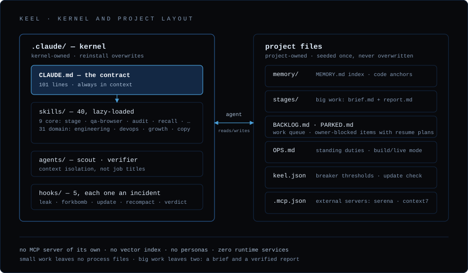

# Architecture

Keel rests on one idea: files are the only shared truth, and the agent is the
orchestrator of the product. Everything below follows from that. Why a
mechanism is in the kernel at all, and what was considered and rejected, is
recorded in the [roadmap](../../ROADMAP.md).



## The contract

[`.claude/CLAUDE.md`](../../bundle/.claude/CLAUDE.md) — 101 lines, always in
context and the only thing that always is. It fixes two things.

Ownership. The agent is the sole executor of the product end to end: no
director, PM, analyst, tester, accountant or ops crew behind it. It invents,
architects, builds, verifies, ships, operates, supports, markets and manages
spend. The contract calls you the owner, and the role is short — you grant
access, set direction, read reports. A user complaint, an error in the logs,
an unhardened port: each is the agent's to notice, queue and fix unasked.

Eleven working rules, a sentence each. Two tiers of work, so a small task
carries no ceremony. Ground in memory before acting — by symptom through the
index, and by location in the code before changing a file you did not just
write — where "read" means opened whole in this session, which has to be
spelled out because Read cuts a long file at 2000 lines without saying so.
Done means product truth: a green build is necessary and never sufficient, UI
work needs a browser pass, a screenshot plus "looks correct" is not a result,
a stage needs the verifier, two failed attempts at one fix stop the attempt
and file the symptom, and a test is never weakened or deleted to get a green
run. One backlog, claimed before work starts, parallel work in
`claude --worktree`. Park what is blocked on you. Audits file findings instead
of hoarding them, and twenty open findings are burned down before the next
audit starts. Persistent processes start only through the safe launcher.
Secrets never appear in files, and the hosts and credentials no hook can
recognize are the agent's to catch. Subagents are for context isolation, not
role-play. Session start sweeps parked work and standing duties. And answer
first: the verdict is the opening line, and a claim about the state of the
system is made after checking it or marked "not checked".

The rest of the kernel is pointers; procedures live in skills and enter
context only when used.

This file's one job is to be there always, so I measured that instead of
assuming it. On Claude Code 2.1.87 a `PreCompact` hook rewrote the contract on
disk while the compaction ran; on the next user turn the model answered from
the rewritten text, in both placements — `.claude/CLAUDE.md` and a root
`CLAUDE.md` — and `InstructionsLoaded` fired for the file with
`load_reason: compact`. Inside the turn that was compacting, the old text
still held. So the placement stays: no root pointer, no rules file. What
compaction does drop is handed back by a hook, below.

## The files

```text
memory/       lessons · antipatterns · patterns, indexed by MEMORY.md
BACKLOG.md    the one canonical work queue
PARKED.md     work blocked on you, each item with a resume plan
OPS.md        standing duties: cadence + operating mode + access registry
stages/       NNN-slug/brief.md + report.md — big work only
qa-baseline/  reference screenshots the browser pass compares against
```

Any conclusion worth keeping past the session gets written down the moment it
exists; whatever stays only in the context window is gone when the window is.

Memory is markdown notes plus a strict one-line index, and retrieval is
reading the index and grepping. No embedding model, no vector store, no
reranker; [why-keel](why-keel.md) has what happened when there were.

`OPS.md` is what makes ownership routable: standing duties, each with a
cadence and the skill that executes it, in one of two modes.

- `build` — no scheduled token burns. Duties run opportunistically, when there
  is idle capacity.
- `live` — your go-live call. The full cadence runs and overdue duties become
  backlog items on their own. Five schedulers exist and reach different
  things: `/loop` inside an open session (an interval that dies with the
  session); system cron running `claude -p` on your own machine (local files,
  `.secrets.env`, MCP — but `-p` starts in manual permission mode, so it needs
  `--permission-mode` and allow rules or the run denies itself silently);
  Claude Desktop scheduled tasks (local files and MCP, only while the app is
  open); cloud routines (a fresh clone of the repository, no local files, no
  local MCP, one hour minimum); GitHub Actions (a fresh clone, no daily cap).
  `OPS.md` names them and you pick. The kernel schedules nothing by itself,
  and nothing prints at session start on the happy path.

## Code and knowledge

`remember` writes down what the project learned; the `recall` skill finds it
again by location in the code. Grounding by symptom is grep: to find the
lesson about a failure, you already have to suspect that failure. Grounding by
location answers the question that is actually open before you touch a file:
what does this project know about `apps/web/proxy.ts`?

Until 1.5.0 that question had no answer. In a real project memory of 222
notes, 141 name code files — 494 mentions across 237 unique files — and none
of it was reachable from the code side.

A note now declares the code it is about, in front-matter:

```yaml
code:
  - apps/web/proxy.ts#handleRequest
  - apps/web/middleware.ts
```

`path/to/file.ts#symbol`, or just the file. Two queries:

```sh
# what we know about this code — before you touch it
bash .claude/skills/recall/anchors.sh apps/web/proxy.ts

# anchors that no longer resolve
bash .claude/skills/recall/anchors.sh --check
```

Results come back in two sets. ANCHORED is the notes that declared this code
in their front-matter: exact and checkable. MENTIONED is the notes that merely
name it in prose, ranked by mention density — useful, noisy, and unverifiable.

Rot detection is the reason anchors exist. Rename a symbol or delete a file
and `--check` reports `DEAD_SYMBOL` or `DEAD_FILE`: the note describes code
that no longer exists, and you hear it before you act on it. A prose mention
can never be checked this way, and dead anchors are filed as P2 findings like
anything else. The structural map runs on the same mechanism now:
`codebase-map` writes its map as a memory note anchored to the entry points it
found, so the day the tree stops matching it, `--check` says so instead of a
`scout` navigating by a map that went wrong months ago.

`--backfill` bootstraps anchors from the prose already in memory: those 141
notes named their code long before the `code:` block existed, and anchoring
them one at a time is the chore that never gets done. It anchors a mention
only when it resolves against the real tree to exactly one file, so
`apps/web/proxy.ts` lands on that file's true path even when the monorepo
keeps the app a level down. A bare `route.ts` matching many files is
ambiguous, a name matching nothing is unresolved, and both are reported and
left for you: anchoring a path that does not resolve would only manufacture
the dead anchor `--check` exists to find. It is a dry run until `--apply`,
which skips notes already carrying a `code:` block. On the 222-note memory it
produced only live anchors.

Code-to-code edges are deliberately not built here. Callers, references,
import trees, call hierarchy — serena (an LSP, seeded in `.mcp.json`) computes
them exactly and live: `find_symbol`, `find_referencing_symbols`. A
hand-maintained map of code structure rots on the first refactor, and a rotted
map is worse than none; an LSP does not rot. The anchors layer carries the one
edge no LSP can derive: what the project learned about a place in the code —
that this file fork-bombed a Mac, that this route shipped green and broke in
prod.

The contract's memory rule routes to the skill: before changing a file you did
not just write, ground by location with `recall`. Adding that clause is what
grew the contract from 79 lines to 81 back in 1.5.0; it stands at 101 today. A
skill nothing routes to is a skill nobody uses, which is how the predecessor's
catalog died.

## Two memories, one truth

Claude Code keeps an auto memory of its own, in
`~/.claude/projects/<project>/memory/`: what you corrected, what you prefer,
what you had to repeat. I leave it switched on — the notes it takes are real —
but it lives outside the repository and on one machine, and nothing in the
kernel can read it. Anything that should outlive this laptop has to cross
over.

Two skills do the crossing. `remember` writes what the project learned into
`memory/`, anchored to the code it is about; a lesson about how the agent
itself works also becomes a `BACKLOG.md` line tagged `src:kernel`, because
that one belongs in the kernel rather than in a note. `adopt-feedback` sweeps
the auto memory: it reads the feedback notes there without ever writing back
and routes each one — a fact into `memory/`, concrete work into `BACKLOG.md`,
a rule about how to work into a `src:kernel` line. If the directory is not
there the report says "auto memory not checked", never "no corrections found".
It runs as a monthly `OPS.md` duty rather than when you think to ask; the pain
behind it is the same correction given twice, once into a machine-local note
and once out loud.

Redirecting the auto memory into `memory/` with `autoMemoryDirectory` was
rejected: the value must be an absolute path, so it cannot ship with a
repository, and both mechanisms want their own `MEMORY.md` format.

## The note graph

The note-to-note graph is memory hygiene, and for that it is genuinely useful.
Its edges are the `[[wikilinks]]` inside the `memory/*.md` notes, where they
have always lived. `graph.sh` reads them and reports hubs, dead links and
orphans; on a real project memory it counts 919 edges after discounting prose
and code false positives, 0 dead links and 4 orphans. No index, no daemon, no
build step.

```sh
# hubs (most-cited notes), dead links, orphans; --edges for the raw list
bash .claude/skills/memory-consolidation/graph.sh
```

What I dropped from SkillForge is the scorer, not the graph. SkillForge did
not treat its graph as a source of truth either: it rebuilt one on every
search from the same wikilinks in the same files (`buildLinkGraph` in
`retrieval-eval.ts`), ran personalized PageRank over it as a boost multiplier
on a vector-plus-keyword score, and cached a copy "for inspection": derived,
regenerable, never the source. The value of that term was never demonstrated —
the retrieval stack saturated at recall@5 = 1.0 on a golden set of 6 queries,
and at the ceiling credit cannot be attributed to it; the breakdown is in
[why-keel](why-keel.md). The graph is walked by the model now, sent there by
the contract's memory rule.

Both graphs connect notes to notes; neither ever knew the code, which is what
`recall` is for. (`memory/` is plain markdown with wikilinks, so it also opens
in Obsidian or VS Code Foam — that comes with the file format; the kernel adds
nothing to it.)

## Two tiers of work

| | Small | Big |
|---|---|---|
| **What** | Single surface, short, low risk | Multi-surface, risky, or multi-hour |
| **Protocol** | Do it, verify it, move on | Skill `stage` |
| **Artifacts** | None | `stages/NNN-slug/brief.md` before, `report.md` after |

That's all the process there is. The predecessor demanded the same ~3.8k
tokens of protocol before the first line of code whether the task was an
architecture rewrite or a padding fix, and small work paid for it in context.

What the `stage` skill adds is the part that has to exist before the work.
Done criteria: three to seven checkable statements, each one that could fail,
used by the verifier as its yardstick — a report always confirms the "done"
that was read out of it, so the definition cannot be derived from the report
afterwards. One line naming who reads the result and what they will do with
it. Then a premortem in three rounds: it is the brief's date plus the horizon
and this work has failed, so name the causes that follow from this brief, each
tied to a file or section of it and each with a signal that would show it in
the first week; defend each cause against the obvious objection; then make the
smallest edits to the brief that close the top three. A cause without an
observable signal does not count, and the brief must be readable by an agent
that never saw this session.

At close, `report.md` carries per-unit evidence, which premortem causes
materialized and by which signal, and the verifier's verdict; unfinished units
become `BACKLOG.md` items rather than silent loss. It carries no narrative —
it is read to decide what happens next. Then `/clear`: the next stage starts
from its brief instead of the tail of this conversation.

## Parallel work

One surface, one session at a time. When work does fan out, units run as
`claude --worktree <surface>`: each session gets its own checkout and the
harness blocks edits to the main one, so two units cannot overwrite each
other's files. This stack once had parallel migrations silently clobber each
other's SQL function bodies. Across those sessions `claim:<MMDD-tag>` in
`BACKLOG.md` stays the queue; a claim dated older than a day with no progress
trace is stale and can be taken over.

A worktree is a fresh checkout, which by definition holds no ignored files —
so `.secrets.env`, the one file the whole project depends on, is absent there
unless something names it. The installer seeds `.worktreeinclude` with exactly
that line. Commit the stage's work before fanning out: a worktree branches
from the default branch and would not otherwise see it.

The hooks had to be tried inside one rather than assumed to work. In a session
launched with `claude --worktree`, `CLAUDE_PROJECT_DIR` is the worktree, the
worktree's own `settings.json` is the one read, `.worktreeinclude` did carry
`.secrets.env`, and `forkbomb-guard` denied from inside. A session that enters
a worktree later keeps the variable, the docs say, on the main checkout while the payload's
`cwd` follows — which is why `recompact` takes the project from `cwd`, and why
a test case runs every hook with those two disagreeing.

## Skills

40 markdown procedures under `.claude/skills/`, lazy-loaded: the body of a
skill costs nothing until it is used.

- Core (9): `stage`, `qa-browser`, `audit`, `remember`, `recall`,
  `safe-dev-server`, `migrate`, `integrations`, `adopt-feedback`
- Domain (31): engineering (code, security, architecture, data model, API,
  performance, tests, tech debt), devops (CI, deploy, observability,
  dependencies), growth (funnel, CRO, SEO, pricing, PMF, positioning,
  competitors), design port, copy and support.

Lazy is not free. The *descriptions* of all 40 load every session, minus the
four that carry `disable-model-invocation` and never reach the listing at all:
`migrate` moves files, `site-sweep` starts a half-hour crawl, `integrations`
and `adopt-feedback` interview you, and none of those should start on a guess.
So the listing is 36 descriptions, about 2k tokens, and that is what a catalog
costs even when nothing is invoked. The documented default budget for it is 1%
of the context window, 2k tokens on a 200k model and before the harness's own
bundled skills are counted; on overflow, descriptions are dropped silently,
least-invoked first, which on a fresh install is any of them. So
`settings.json` pins `skillListingBudgetFraction: 0.02`; the CLI that built
1.8.0 does not know the key yet and ignores it.

The five skills that run a kernel script — `recall`, `qa-browser`,
`safe-dev-server`, `migrate`, `memory-consolidation` — name its exact path in
`allowed-tools`, so the sanctioned path costs no permission prompt, and the
bundle test checks that the named path exists.

`/skill-doctor` reports which skills were never used and what the listing
costs; a project that does not need a whole family hides it with
`skillOverrides` in its own settings rather than deleting kernel files a
reinstall would bring back. I have not cut the domain catalog on a guess: all
31 landed at once, no project has run long enough to show which are dead, and
`OPS.md` maps nineteen duties onto eighteen of them. Skills you write yourself
live alongside these and survive a reinstall.

### The browser sweep

`qa-browser` is where the contract routes UI work, and its programmatic pass
now ships as a file — `sweep.mjs`, 158 lines of Playwright — instead of a code
block to copy. It runs three viewports over every page a change touched and
writes JSON; you read the JSON, never the pages.
`invisible-overlay-eats-clicks` is a historical bug written down as a check:
an `opacity:0` panel with `pointer-events:auto` over the FAB, eating every
mobile click, invisible in every screenshot. `click-stolen` is the same theft
one control at a time, at the centre of a control's visible part;
`low-contrast` is text under 4.5:1 against the nearest opaque background,
twelve per page.

A check that cries wolf gets ignored, so the hit-test was measured before it
shipped: eight public sites in three viewports, 24 pages, plus a local Astro
build of 18. The first run reported 12 stolen clicks, all false positives of
three kinds — a link wrapped over two lines, whose box has its centre between
the lines; a screen-reader-only skip link; a link cut off by a cell with
overflow hidden. The sweep now probes the first line box, skips clipped
controls and clips the box to its visible part; the rerun reports none, and
`test/fixtures/sweep.html` holds a real theft it must still catch. Both checks
stay candidates to confirm by eye: a `<label>` covering its own input is
legitimate, and a contrast ratio near 1.0 usually means the real background is
a sibling layer the check cannot see.

The reference for a screenshot comparison is a tracked file under
`qa-baseline/`, changed only with a verifier pass or by you. A baseline any
session may overwrite proves nothing.

## Subagents

Two, split by context isolation rather than job title:

- `scout` — read-only exploration, on sonnet at medium effort. It burns its
  context on a search so the main thread does not have to, starts from the
  project's map when there is one, and lists the files it opened whole apart
  from the ones it only excerpted, because a fact taken from an excerpt is a
  lead rather than a read.
- `verifier` — an independent judge of done-ness, on opus, with `qa-browser`
  preloaded so it can exercise a UI instead of reading about one. Before
  granting a pass it names the check that would have refuted the claim; every
  fail carries a severity — blocker, important, optional — and what to fix
  first is the author's call, not the judge's. Two rounds at most, the second
  over the first round's fails and regressions rather than the work anew. Stage-level
  work counts as done only once the verifier confirms it; the author's own
  report is not that confirmation.

Each agent runs on the model its own front-matter names rather than on
whatever the session is running — a judge that inherits the session's model is
not independent of it. A project can override every agent at once with
`CLAUDE_CODE_SUBAGENT_MODEL_FORCE`.

Role-shaped personas (product, qa, devops, …) are deliberately absent. They
spend more tokens coordinating than working, and they drift: the predecessor
had to police them with a hard 55-line cap and an automated check.

## Hooks

Seven, each one kept because of something that actually happened:

- `leak-guard.sh` (`PreToolUse` on writes) — blocks a write that would put a
  secret value in a file; secrets are written as `{{secret:KEY}}` and values
  live in `.secrets.env`. It scans only the text being written, because
  scanning the whole payload also blocked the edit that removes a leaked
  secret: the value still sits in `old_string`. Values under six characters
  are ignored, or `PORT=8080` would make every document a violation.
- `forkbomb-guard.sh` (`PreToolUse` on Bash) — denies raw launches of
  persistent processes. Next.js with Turbopack once fork-bombed a Mac; dev
  servers now go through `safe-dev-server`'s `safe-run` launcher, which caps
  the descendant process tree, waits for a healthy start and reaps the whole
  group at once. One-shot builds and test runs pass straight through;
  thresholds live in `keel.json`.
- `verdict-guard.sh` (`PreToolUse` on `Write|Edit`) — refuses a fabricated
  verifier verdict in a stage report. Described below.
- `update-check.sh` (`SessionStart`) — one line when a newer Keel exists,
  silence otherwise and on every failure path (offline, rate-limited,
  unparseable, no cache directory). `KEEL_NO_UPDATE_CHECK=1` disables it.
- `recompact.sh` (`SessionStart`, matcher `compact`) — hands back what a
  context compaction dropped. Described below.
- `loop-guard.sh` (`PostToolUseFailure` on Bash) — on the third failure of the
  same command with the same first error line, it puts one sentence into
  context: the two-attempts rule, arriving three retries deep, at the moment
  it is hardest to recall. It never blocks, since a re-run after a real fix is
  the same command. The signature is the command with whitespace collapsed
  plus that error line with every run of digits folded, so a port, a pid or a
  duration cannot make three identical failures look like three different
  ones.
- `index-guard.sh` (`PostToolUse` on writes) — says when `memory/MEMORY.md`
  has passed 250 lines or one line has passed 300 characters. Advisory: the
  write already happened, so the hook only speaks. The predecessor's index
  grew bodies into itself one convenient paragraph at a time until reading it
  cost more than reading the notes, and then it stopped being read.

Each hook reads its JSON payload with `jq` when it is there and `python3`
otherwise; with neither, `leak-guard` scans the raw payload — noisier, never
quieter — and the guards that cannot read a payload allow the call rather than
guess at it. The two advisory hooks are on probation, on the terms the
[roadmap](../../ROADMAP.md) states: `loop-guard` keeps a tally of its own
firings, and firing more than once per session on average means the threshold
rises or the hook goes.

One rule needs no hook at all. `settings.json` carries
`permissions.deny: Read(./.secrets.env)`, and I measured what that actually
stops on Claude Code 2.1.87: the Read tool and `cat` are refused, a `grep -r`
from the directory is not, and the sandbox closes that when you turn it on.
Newer versions refuse writing the file too, so you fill it by hand — the
intended division anyway, since the values are yours and the placeholders are
the agent's.

### After compaction

Compaction is the documented moment a long session goes blind. The transcript
is summarized, the skill listing is not re-injected, and hook output from
earlier in the session is summarized away, so the model comes back fluent in
the code and unaware of which stage it is in, which backlog items it claimed
and which gates it still owes.

`recompact.sh` recomputes exactly those from disk: the active stage (the last
one carrying a brief) and its goal line, the open `claim:` lines in
`BACKLOG.md`, and one line of gates — qa-browser before UI is done, verifier
before a stage closes, recall before touching unfamiliar code, remember after
a lesson — plus a reminder that skills load on use. The budget is twelve
lines, because everything it prints lands in context on every compaction; it
is a pointer back to the files, not a digest of them. A project with no stage
and no claims gets the reminders only, and the hook exits 0 on every path.

### Verdicts are receipts

A stage closes on the verifier's verdict, and a verdict is the one thing a
session cannot produce by introspection. Typing `6 pass / 0 fail` into
`report.md` is the cheapest possible way to fake done-ness, and afterwards it
reads exactly like a real pass. That happened once in production.

So the `stage` skill creates the Verifier section as a placeholder — "run
pending" — and only a real run fills it, by pasting the agent's summary line
together with its agent id. `verdict-guard.sh` enforces the receipt: on a
write to `stages/*/report.md` it looks for a pass/fail count, and if one is
there without an agent id anywhere in the new text, the write is denied. The
id exists only if a run happened. The honest placeholder always passes, and
everything outside a stage report passes untouched.

## What the project can reach

Access is yours to grant, and the kernel treats it as something to record
rather than to acquire. At the end of an install, `install.sh` prints one line
per integration it can detect on the machine — `gh`, `uvx`, `npx`, `node`,
`python3`, `codex`, `gemini`, Playwright browsers — and installs none of them
and signs into nothing. The `.mcp.json` seed is filtered the same way, down to
the servers whose launcher exists: a server that cannot start is retried at
every session start and reported as a failure you did not cause.

The `integrations` skill turns detection into a record. It asks one question
per item — presence is not access, and an installed `gh` says nothing about
being signed in — and writes the answers into the `OPS.md` access registry,
where every later session reads them. Run it as `/integrations` on the first
session after installing, or whenever the answer changed. It never writes a
credential into any file: names of keys live in the registry, values only in
`.secrets.env`.

## Testing the kernel

The kernel is shell scripts, and a script that is never exercised rots like
any other code. `test/run.sh` sources `test/cases/*.sh`, one file per zone,
over 400 self-tests in all: every hook (the two newest against a real captured
payload as the fixture), a case that runs all of them with `cwd` and
`CLAUDE_PROJECT_DIR` disagreeing the way a worktree makes them, the installer,
bundle integrity — front-matter, hook paths, skill references, `allowed-tools`
paths, agent models — the shipped scripts `anchors.sh`, `graph.sh` and
migrate's `sweep.sh`, a positive-control page for the browser sweep where
Playwright is present, and the build. Offline, throwaway fixtures in a temp
directory, non-zero exit on the first failed assertion. The exact count is
quoted nowhere, because it differs by machine.

`build-archive.sh` runs the suite before it packs anything and refuses to
build if a single case fails; a script that fails its own test never ships.
Every case encodes a bug that actually shipped and was caught only by
adversarial review: `--check` missing a `handleRequest` to `handleRequestV2`
rename because `grep -F` is a substring match, and MENTIONED ranking by
matching lines instead of mentions. Every hook has a test now, the four added
in this release included.

One zone tests the documentation. Five releases in a row shipped a stale
number — the contract's line count, the shell totals, the bundle size —
because each was re-measured by hand and the hand skipped a file.
`test/metrics.sh` prints every number the docs quote, measured from the tree,
and a case compares that output against the claims in the README, the badges,
these guides and the diagrams. Its commands are the ones the docs hand you, so
running them by hand gives the same figures.

Like `build-archive.sh`, `test/run.sh` is maintainer-only — 1,858 of the
kernel's 4,193 lines of shell — and never lands in a project.

## What is kernel-owned vs project-owned

```text
.claude/     kernel-owned — reinstalling overwrites it. Never edit in place.
everything   project-owned — the installer creates it once and never touches
else         it again.
```

Your own additions inside `.claude/` are the exception a reinstall respects:
skills you wrote, `settings.local.json`, `commands/`, `rules/`,
`output-styles/` and your own agents are carried across file by file, and only
where the kernel has nothing at that path, so a kernel file is never shadowed
by a stale copy of itself. If the install fails its own self-check it puts the
previous `.claude` back.

Kernel changes happen in the keel repo and reach projects by reinstall. If you
edit a kernel file inside a deployed project, the change dies at the next
update.
