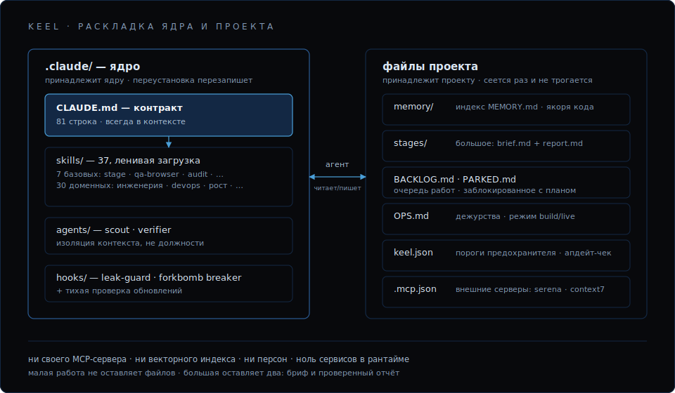

# Архитектура

Keel построен на одной идее: файлы — единственная общая правда, а агент —
оркестратор. Всё остальное — следствия.



## Контракт

[`.claude/CLAUDE.md`](../../bundle/.claude/CLAUDE.md) — 81 строка, всегда в
контексте, и это единственное, что там всегда. Контракт фиксирует две вещи.

Владение. Агент — единственный исполнитель продукта от начала до конца. За
ним нет ни директора, ни PM, ни аналитика, ни тестировщика, ни бухгалтера,
ни службы эксплуатации. Он придумывает, проектирует, строит, проверяет,
выкатывает, эксплуатирует, поддерживает, продаёт и управляет расходами.
Владелец — заказчик: выдаёт доступы, задаёт направление, читает отчёты.
Жалобу пользователя, ошибку в логах, незакрытый порт агент обязан заметить,
поставить в очередь и починить сам, без напоминания.

Десять рабочих правил. Два уровня работы; опереться на память до действия —
по симптому через индекс и по месту в коде, прежде чем менять файл, который
не ты только что написал; «готово» — это правда о продукте, а не зелёная
сборка; один бэклог; заблокированное — на парковку; аудит заводит находки,
а не копит их; долгоживущие процессы — только через безопасный лаунчер;
секреты — никогда в файлах; сабагенты — ради изоляции контекста, а не
ролевой игры; на старте сессии пройтись по парковке и дежурствам.

Всё остальное ядро — указатели. Процедуры живут в скиллах и попадают в
контекст только при использовании.

## Файлы

```text
memory/       lessons · antipatterns · patterns, индексируются MEMORY.md
BACKLOG.md    единственная каноническая очередь работ
PARKED.md     работа, ждущая владельца, у каждой — план возобновления
OPS.md        постоянные дежурства: периодичность + режим работы + реестр доступов
stages/       NNN-slug/brief.md + report.md — только для большой работы
```

Вывод, которому предстоит пережить сессию, записывается в тот момент, когда
он появился: что осталось только в окне контекста, исчезает вместе с ним.

Память — это markdown-заметки плюс строгий однострочный индекс. Поиск —
чтение индекса и grep. Ни модели эмбеддингов, ни векторного хранилища, ни
реранкера; что было, когда они были, описано в [why-keel](why-keel.md).

`OPS.md` — то, что делает владение маршрутизируемым: постоянные дежурства,
у каждого периодичность и скилл-исполнитель, в одном из двух режимов.

- `build` — никаких плановых трат токенов. Дежурства выполняются
  оппортунистически, когда есть свободная ёмкость.
- `live` — решение владельца о go-live. Система поднимает cron и плановые
  прогоны и включает полную периодичность.

## Код и знание

`remember` записывает то, что проект узнал; скилл `recall` находит это
снова — по месту в коде. Заземление по симптому — это grep: чтобы найти
урок про сбой, надо уже подозревать этот сбой. Заземление по месту отвечает
на вопрос, который реально стоит перед правкой файла: что проект знает про
`apps/web/proxy.ts`?

До 1.5.0 у этого вопроса не было ответа. В реальной проектной памяти из 222
заметок 141 называет файлы кода — 494 упоминания, 237 уникальных файлов — и
ничто из этого не было достижимо со стороны кода.

Заметка теперь объявляет код, о котором она написана, прямо во front-matter:

```yaml
code:
  - apps/web/proxy.ts#handleRequest
  - apps/web/middleware.ts
```

`path/to/file.ts#symbol` либо просто файл. Два запроса:

```sh
# что мы знаем про этот код — до того, как его трогать
bash .claude/skills/recall/anchors.sh apps/web/proxy.ts

# якоря, которые больше не разрешаются
bash .claude/skills/recall/anchors.sh --check
```

Ответ приходит двумя наборами. ANCHORED — заметки, объявившие этот код во
front-matter: точно и проверяемо. MENTIONED — заметки, которые лишь
называют его в прозе, ранжированные по плотности упоминаний: полезно, но
шумно, и проверить их нечем.

Детект гнили — то, ради чего якоря и сделаны. Переименуйте символ или
удалите файл, и `--check` доложит `DEAD_SYMBOL` / `DEAD_FILE`: заметка
описывает код, которого больше нет, и об этом становится известно до того,
как на неё опёрлись. Упоминание в прозе так не проверяется. Мёртвые якоря
заводятся в бэклог как находки P2, наравне с остальными.

`--backfill` навешивает якоря на прозу, которая уже лежит в памяти. Те 494
упоминания появились задолго до блока `code:`, а вешать якоря руками по
одному — работа, до которой не доходят руки. `--backfill` читает каждую
заметку, сверяет каждое названное имя файла с реальным деревом исходников и
ставит якорь только там, где имя разрешается ровно в один файл:
`apps/web/proxy.ts` из заметки попадает на истинный путь, даже если
монорепозиторий держит приложение в подкаталоге, которого заметка не
упоминала. Голое `route.ts`, совпадающее со многими файлами, —
неоднозначность; имя, не совпавшее ни с чем, — неразрешённое; и то и другое
докладывается и остаётся на ваше решение: якорь на неразрешённом пути — это
собственноручно изготовленный мёртвый якорь, тот самый, который потом ищет
`--check`. По умолчанию — сухой прогон; `--apply` пишет front-matter и
пропускает заметки, где блок `code:` уже есть, так что повторный запуск
идемпотентен. На памяти из 222 заметок он разобрал префикс монорепозитория
и оставил только живые якоря.

```sh
# сверить упоминания в прозе с реальным деревом — только предпросмотр
bash .claude/skills/recall/anchors.sh --backfill

# записать якоря (идемпотентно; уже заякоренные заметки пропускаются)
bash .claude/skills/recall/anchors.sh --backfill --apply
```

Рёбра код→код здесь не строятся, и это осознанно. Вызывающих, ссылки и
иерархию вызовов считает serena (LSP, прописана в `.mcp.json` при
установке): `find_symbol`, `find_referencing_symbols` — точно и вживую.
Карта структуры кода, которую ведут руками, гниёт на первом же
рефакторинге, а прогнившая карта хуже её отсутствия; LSP не гниёт. Слой
якорей несёт единственное ребро, которого не выведет ни один LSP: что мы
узнали про это место в коде — что этот файл форк-бомбил Mac, что этот роут
уехал зелёным и сломался в проде.

Правило 2 контракта туда и маршрутизирует: прежде чем менять файл, который
не ты только что написал, заземлись по месту — скилл `recall`. Из-за этой
строки контракт вырос с 79 строк до 81. Скилл, на который ничто не
маршрутизирует, — скилл, которым никто не пользуется; ровно так у
предшественника умер каталог скиллов.

## Граф заметок

Граф заметка↔заметка — это гигиена памяти, и для неё он честно полезен;
большего от него ждать не стоит. Его рёбра — `[[wikilinks]]` внутри заметок
`memory/*.md`, где они лежали всегда. `graph.sh` читает их и докладывает
хабы, битые ссылки и сирот; на реальной проектной памяти — 919 рёбер после
отсева ложных срабатываний в прозе и коде, 0 битых ссылок, 4 сироты. Ни
индекса, ни демона, ни шага сборки. Он показывает, когда память начинает
расползаться, и ничего не говорит о коде. (`memory/` — обычный markdown с
`[[wikilinks]]`, так что он заодно открывается в Obsidian или VS Code Foam;
это свойство формата, а не возможность ядра.)

```sh
# хабы (самые цитируемые заметки), битые ссылки, сироты, итоги
bash .claude/skills/memory-consolidation/graph.sh

# сырой список смежности
bash .claude/skills/memory-consolidation/graph.sh --edges
```

Keel выбросил из SkillForge скорер, а не граф. SkillForge и сам не считал
свой граф источником правды: он пересобирал его на каждом поиске из тех же
`[[wikilinks]]` в тех же файлах (`buildLinkGraph` в `retrieval-eval.ts`),
гонял по нему персонализированный PageRank («HippoRAG-lite») как
множитель-буст `1 + 0.2 * graph` поверх `0.8 * vector + 0.2 * keyword` и
клал копию в `.data/wikilink-graph.json` «для инспекции» — производную,
пересоздаваемую, никогда не исходную. Пользу скорера так и не показали:
весь поисковый стек упирался в потолок recall@5 = 1.0 на золотом наборе из
6 запросов, а на потолке заслугу графового слагаемого не выделить. По графу
заметок теперь ходит модель: правило 2 контракта отправляет её в индекс
`memory/MEMORY.md` и велит идти по ссылкам, подходящим к задаче.

Оба графа — про связи заметок между собой. Про код ни один из них не знал
ничего; для этого есть `recall`.

## Два уровня работы

| | Малая | Большая |
|---|---|---|
| **Что это** | Одна поверхность, коротко, низкий риск | Много поверхностей, риск или несколько часов |
| **Протокол** | Сделать, проверить, идти дальше | Скилл `stage` |
| **Артефакты** | Нет | `stages/NNN-slug/brief.md` до, `report.md` после |

Другого процесса нет. Предшественник требовал одни и те же ~3,8k токенов
протокола до первой строки кода — что при переписывании архитектуры, что
при правке отступа — и малая работа расплачивалась за это контекстом.

## Скиллы

37 markdown-процедур в `.claude/skills/` с ленивой загрузкой: скилл ничего
не стоит, пока им не пользуются.

- Базовые (7): `stage`, `qa-browser`, `audit`, `remember`, `recall`,
  `safe-dev-server`, `migrate`
- Доменные (30): инженерия (код, безопасность, архитектура, модель данных,
  API, производительность, тесты, техдолг), devops (CI, деплой,
  наблюдаемость, зависимости), рост (воронка, CRO, SEO, цены, PMF,
  позиционирование, конкуренты), копирайт и поддержка.

Скиллы, написанные вами, лежат рядом и автоматически переживают
переустановку ядра.

## Сабагенты

Два, разделены по изоляции контекста, а не по должностям:

- `scout` — разведка только на чтение. Сжигает свой контекст на поиске,
  чтобы этого не делал основной поток.
- `verifier` — независимый судья готовности. Самоотчёт — заявление, а не
  вердикт; работа уровня стейджа считается готовой, только когда её
  подтвердил верификатор.

Ролевых персон (product, qa, devops, …) нет намеренно. Они тратят на
координацию больше токенов, чем на работу, и расползаются: предшественнику
приходилось держать их в узде жёстким лимитом в 55 строк и автоматической
проверкой.

## Хуки

Три, и каждый остался потому, что остановил реальный инцидент:

- `leak-guard.sh` (`PreToolUse` на запись) — блокирует запись, которая
  положила бы значение секрета в файл. Секреты пишутся как
  `{{secret:KEY}}`, значения живут в `.secrets.env`.
- `forkbomb-guard.sh` (`PreToolUse` на Bash) — запрещает сырой запуск
  долгоживущих процессов. Next.js + Turbopack однажды форк-бомбили Mac;
  теперь dev-серверы идут через лаунчер `safe-run` из `safe-dev-server` — с
  предохранителем по дереву процессов и снятием всей группы разом. Пороги —
  в `keel.json`.
- `update-check.sh` (`SessionStart`) — одна строка, если вышел более свежий
  Keel, и молчание в остальных случаях.

## Тестирование ядра

Ядро — это shell-скрипты, а скрипт, который никогда не гоняют, гниёт как
любой другой код. `test/run.sh` держит собственные скрипты Keel —
`anchors.sh`, `graph.sh`, `sweep.sh` из миграции, `update-check.sh` — в тех
же рамках, каких контракт требует от кода продукта: каждый прогоняется на
одноразовых фикстурах во временном каталоге, офлайн, с ненулевым кодом
выхода на первом же провалившемся ассерте.

`build-archive.sh` гоняет набор до упаковки и отказывается собирать архив,
если упал хоть один случай: скрипт, проваливший собственный тест, не уезжает
никуда. Каждый случай в наборе — реальный баг, который дошёл до релиза и
был пойман только въедливым ручным разбором: `--check` пропускал
переименование `handleRequest` → `handleRequestV2`, потому что `grep -F`
ищет подстроку, а MENTIONED ранжировался по числу совпавших строк, а не
упоминаний. Набор существует ровно затем, чтобы эти регрессии не вернулись.
Как и `build-archive.sh`, `test/run.sh` — инструмент мейнтейнера: 157
строк, которые проверяют ядро перед релизом и в проект не попадают.

## Что принадлежит ядру, а что проекту

```text
.claude/     принадлежит ядру — переустановка перезаписывает. Не править на месте.
всё          принадлежит проекту — установщик создаёт это один раз и больше
остальное    никогда не трогает.
```

Изменения ядра делаются в репозитории keel и приезжают в проекты
переустановкой. Правка `.claude/` внутри развёрнутого проекта умрёт при
следующем обновлении.
