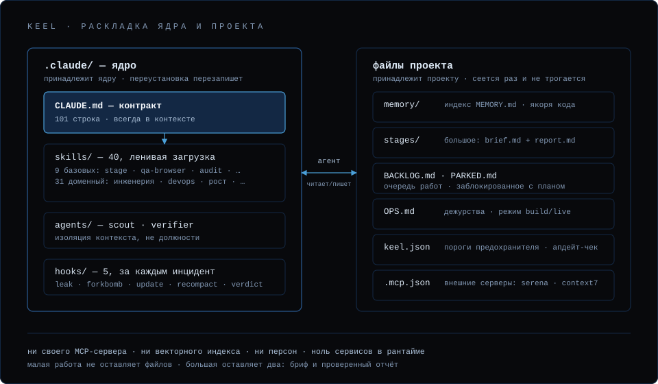

# Архитектура

В основе keel одна идея: файлы — единственная общая правда, а агент —
оркестратор продукта. Всё остальное из неё следует. Почему тот или иной
механизм вообще оказался в ядре и что было рассмотрено и отвергнуто — записано
в [roadmap](../../ROADMAP.md).



## Контракт

[`.claude/CLAUDE.md`](../../bundle/.claude/CLAUDE.md) — 101 строка, всегда в
контексте, и это единственное, что там всегда. Контракт фиксирует две вещи.

Владение. Агент — единственный исполнитель продукта от начала до конца: за ним
нет ни директора, ни PM, ни аналитика, ни тестировщика, ни бухгалтера, ни
службы эксплуатации. Он придумывает, проектирует, строит, проверяет,
выкатывает, эксплуатирует, поддерживает, продаёт и считает расходы. Вас
контракт называет владельцем, и роль эта короткая: выдать доступы, задать
направление, прочитать отчёты. Жалобу пользователя, ошибку в логах, незакрытый
порт агент замечает, ставит в очередь и чинит сам, без напоминания.

Одиннадцать рабочих правил, по предложению на каждое. Два уровня работы, чтобы
малая задача не тащила за собой церемонию. Опереться на память до действия —
по симптому через индекс и по месту в коде, прежде чем менять файл, который не
ты только что написал, — причём «прочитал» значит «открыл целиком в этой
сессии», и это приходится проговаривать, потому что Read обрезает длинный файл
на двухтысячной строке и молчит об этом. «Готово» — это правда о продукте:
зелёная сборка необходима и никогда не достаточна, работа с UI требует
браузерного прогона, скриншот плюс «выглядит правильно» — не результат, стейдж
закрывает верификатор, две неудачные попытки одной починки прекращают попытку
и заводят симптом, а тест никогда не ослабляют и не удаляют ради зелёного
прогона. Один бэклог, пункт занимается до начала работы, параллельная работа
идёт через `claude --worktree`. Заблокированное вами — на парковку. Аудит
заводит находки, а не копит их, и при двадцати открытых находках их сначала
разгребают. Долгоживущие процессы стартуют только через безопасный лаунчер.
Секреты не появляются в файлах, а хосты и учётки, набранные открытым текстом,
не опознает ни один хук — это забота агента. Сабагенты нужны ради изоляции
контекста, а не ради ролевой игры. Старт сессии выметает парковку и постоянные
дежурства. И отвечать сначала: вердикт — первая строка, а утверждение о
состоянии системы делается после проверки или помечается «не проверял».

Всё остальное ядро — указатели; процедуры живут в скиллах и попадают в
контекст только при использовании.

Единственная обязанность этого файла — быть там всегда, поэтому я это измерил,
а не предположил. На Claude Code 2.1.87 хук `PreCompact` переписывал контракт
на диске прямо во время сжатия; на следующем ходу пользователя модель отвечала
уже по переписанному тексту — и из `.claude/CLAUDE.md`, и из корневого
`CLAUDE.md`, — а `InstructionsLoaded` срабатывал для файла с
`load_reason: compact`. Внутри того хода, который сжимался, ещё держался
старый текст. Значит, размещение остаётся как есть: ни указателя в корне, ни
отдельного файла правил. А то, что сжатие действительно теряет, возвращает хук
— о нём ниже.

## Файлы

```text
memory/       lessons · antipatterns · patterns, индексируются MEMORY.md
BACKLOG.md    единственная каноническая очередь работ
PARKED.md     работа, ждущая вас, у каждой — план возобновления
OPS.md        постоянные дежурства: периодичность + режим работы + реестр доступов
stages/       NNN-slug/brief.md + report.md — только для большой работы
qa-baseline/  эталонные скриншоты, с которыми сверяется браузерный прогон
```

Вывод, которому предстоит пережить сессию, записывается в тот момент, когда он
появился: что осталось только в окне контекста, исчезает вместе с ним.

Память — это markdown-заметки плюс строгий однострочный индекс, а поиск —
чтение индекса и grep. Ни модели эмбеддингов, ни векторного хранилища, ни
реранкера; что было, когда они были, описано в [why-keel](why-keel.md).

`OPS.md` — то, что делает владение маршрутизируемым: постоянные дежурства, у
каждого периодичность и скилл-исполнитель, в одном из двух режимов.

- `build` — никаких плановых трат токенов. Дежурства выполняются
  оппортунистически, когда есть свободная ёмкость.
- `live` — ваше решение о go-live. Работает полная периодичность, а
  просроченные дежурства сами превращаются в пункты бэклога. Планировщиков
  пять, и дотягиваются они до разного: `/loop` внутри открытой сессии
  (интервал, который умирает вместе с сессией); системный cron с `claude -p`
  на вашей машине (локальные файлы, `.secrets.env`, MCP — но `-p` стартует в
  ручном режиме разрешений, так что нужны `--permission-mode` и allow-правила,
  иначе прогон молча откажет сам себе); плановые задачи Claude Desktop
  (локальные файлы и MCP, только пока приложение открыто); облачные routines
  (свежий клон репозитория, без локальных файлов и локального MCP, минимум
  час); GitHub Actions (свежий клон, без суточного лимита). `OPS.md` их
  называет, выбираете вы. Само ядро не планирует ничего и на счастливом пути
  при старте сессии не печатает ни строки.

## Код и знание

`remember` записывает то, что проект узнал; скилл `recall` находит это снова —
по месту в коде. Заземление по симптому — это grep: чтобы найти урок про сбой,
надо уже подозревать этот сбой. Заземление по месту отвечает на вопрос,
который реально стоит перед правкой файла: что проект знает про
`apps/web/proxy.ts`?

До 1.5.0 у этого вопроса не было ответа. В реальной проектной памяти из 222
заметок 141 называет файлы кода — 494 упоминания, 237 уникальных файлов — и
ничто из этого не было достижимо со стороны кода.

Заметка теперь объявляет код, о котором она написана, прямо во front-matter:

```yaml
code:
  - apps/web/proxy.ts#handleRequest
  - apps/web/middleware.ts
```

`path/to/file.ts#symbol` либо просто файл. Два запроса:

```sh
# что мы знаем про этот код — до того, как его трогать
bash .claude/skills/recall/anchors.sh apps/web/proxy.ts

# якоря, которые больше не разрешаются
bash .claude/skills/recall/anchors.sh --check
```

Ответ приходит двумя наборами. ANCHORED — заметки, объявившие этот код во
front-matter: точно и проверяемо. MENTIONED — заметки, которые лишь называют
его в прозе, ранжированные по плотности упоминаний: полезно, шумно и ничем не
проверяется.

Детект гнили — то, ради чего якоря и сделаны. Переименуйте символ или удалите
файл, и `--check` доложит `DEAD_SYMBOL` или `DEAD_FILE`: заметка описывает
код, которого больше нет, и вы узнаёте об этом до того, как на неё опёрлись.
Упоминание в прозе так не проверяется, а мёртвые якоря заводятся в бэклог как
находки P2, наравне с остальными. На том же механизме теперь держится и карта
структуры: `codebase-map` пишет её заметкой в память с якорями на найденные
точки входа, так что в день, когда дерево перестанет ей соответствовать, об
этом скажет `--check`, а не выяснится из того, что `scout` месяцами ходил по
неверной карте.

`--backfill` навешивает якоря на прозу, которая уже лежит в памяти: те 141
заметка называли свой код задолго до появления блока `code:`, а вешать якоря
руками по одному — работа, до которой не доходят руки. Якорь ставится только
там, где имя разрешается по реальному дереву ровно в один файл:
`apps/web/proxy.ts` из заметки попадает на истинный путь, даже если
монорепозиторий держит приложение уровнем ниже. Голое `route.ts`, совпадающее
со многими файлами, — неоднозначность; имя, не совпавшее ни с чем, —
неразрешённое; и то и другое докладывается и остаётся на ваше решение: якорь
на неразрешённом пути — это собственноручно изготовленный мёртвый якорь, тот
самый, который потом ищет `--check`. По умолчанию сухой прогон, пока не
сказано `--apply`; заметки с уже готовым блоком `code:` пропускаются. На
памяти из 222 заметок он оставил только живые якоря.

Рёбра от кода к коду здесь не строятся, и это осознанно. Вызывающих, ссылки,
дерево импортов, иерархию вызовов считает serena (LSP, прописана в `.mcp.json`
при установке): `find_symbol`, `find_referencing_symbols` — точно и вживую.
Карта структуры кода, которую ведут руками, гниёт на первом же рефакторинге, а
прогнившая карта хуже её отсутствия; LSP не гниёт. Слой якорей несёт
единственное ребро, которого не выведет ни один LSP: что проект узнал про это
место в коде — что этот файл форк-бомбил Mac, что этот роут уехал зелёным и
сломался в проде.

Правило памяти в контракте туда и маршрутизирует: прежде чем менять файл,
который не ты только что написал, заземлись по месту — скилл `recall`. Из-за
этой строки контракт вырос с 79 строк до 81 ещё в 1.5.0; сегодня в нём 101.
Скилл, на который ничто не маршрутизирует, — скилл, которым никто не
пользуется; ровно так у предшественника умер каталог скиллов.

## Две памяти, одна правда

У Claude Code есть собственная авто-память, в
`~/.claude/projects/<проект>/memory/`: что вы поправили, что предпочитаете,
что пришлось повторить. Я её не выключаю — заметки там настоящие, — но живёт
она вне репозитория и на одной машине, и ядро её не видит. Всё, чему положено
пережить этот ноутбук, должно перейти на другую сторону.

Переводят два скилла. `remember` пишет то, что узнал проект, в `memory/`, с
якорем на код, о котором заметка; урок про то, как работает сам агент,
становится ещё и строкой в `BACKLOG.md` с меткой `src:kernel` — такому место в
ядре, а не в заметке. `adopt-feedback` выметает авто-память: он читает
тамошние заметки с обратной связью, никогда туда не записывая, и разводит
каждую по назначению — факт в `memory/`, конкретную работу в `BACKLOG.md`,
правило о том, как работать, в строку `src:kernel`. Если каталога нет, в
отчёте будет «авто-память не проверял», а не «поправок не найдено». Идёт он
ежемесячным дежурством в `OPS.md`, а не тогда, когда вы вспомнили попросить:
боль за этим — одна и та же поправка, сказанная дважды, один раз в заметку на
конкретной машине и один раз вслух.

Перенаправить авто-память в `memory/` через `autoMemoryDirectory` отвергнуто:
значение должно быть абсолютным путём, так что с репозиторием оно не поедет,
да и формат `MEMORY.md` каждый из двух механизмов хочет свой.

## Граф заметок

Граф «заметка — заметка» — это гигиена памяти, и для неё он честно полезен.
Его рёбра — `[[wikilinks]]` внутри заметок `memory/*.md`, где они лежали
всегда. `graph.sh` читает их и докладывает хабы, битые ссылки и сирот; на
реальной проектной памяти — 919 рёбер после отсева ложных срабатываний в прозе
и коде, 0 битых ссылок, 4 сироты. Ни индекса, ни демона, ни шага сборки.

```sh
# хабы (самые цитируемые), битые ссылки, сироты; --edges — сырой список
bash .claude/skills/memory-consolidation/graph.sh
```

Из SkillForge я выбросил скорер, а не граф. SkillForge и сам не считал свой
граф источником правды: он пересобирал его на каждом поиске из тех же
`[[wikilinks]]` в тех же файлах (`buildLinkGraph` в `retrieval-eval.ts`),
гонял по нему персонализированный PageRank как множитель-буст поверх
векторно-ключевого скора и клал копию «для инспекции» — производную,
пересоздаваемую, никогда не исходную. Пользу этого слагаемого так и не
показали: весь поисковый стек упирался в потолок recall@5 = 1.0 на золотом
наборе из 6 запросов, а на потолке заслугу не выделить; разбор — в
[why-keel](why-keel.md). По графу заметок теперь ходит модель, которую туда
отправляет правило памяти в контракте.

Оба графа — про связи заметок между собой; про код ни один из них не знал
ничего, для этого есть `recall`. (`memory/` — обычный markdown с
`[[wikilinks]]`, так что он заодно открывается в Obsidian или VS Code Foam;
это свойство формата, а не возможность ядра.)

## Два уровня работы

| | Малая | Большая |
|---|---|---|
| **Что это** | Одна поверхность, коротко, низкий риск | Много поверхностей, риск или несколько часов |
| **Протокол** | Сделать, проверить, идти дальше | Скилл `stage` |
| **Артефакты** | Нет | `stages/NNN-slug/brief.md` до, `report.md` после |

Другого процесса нет. Предшественник требовал одни и те же ~3,8k токенов
протокола до первой строки кода — что при переписывании архитектуры, что при
правке отступа, — и малая работа расплачивалась за это контекстом.

Скилл `stage` добавляет то, что обязано существовать до работы. Критерии
готовности: от трёх до семи проверяемых утверждений, каждое из которых может
не выполниться, — по ним судит верификатор, потому что отчёт всегда
подтверждает то «готово», которое из него и вычитали, и выводить определение
из отчёта задним числом нельзя. Одна строка о том, кто прочитает результат и
что с ним сделает. Дальше премортем в три круга: наступила дата брифа плюс
горизонт, работа провалилась — назови причины, которые следуют из этого брифа,
каждую с привязкой к файлу или разделу и с сигналом, по которому её было бы
видно на первой неделе; защити каждую от очевидного возражения; затем внеси в
бриф минимальные правки, закрывающие первые три. Причина без наблюдаемого
сигнала не считается, а бриф должен читаться агентом, который этой сессии не
видел.

На закрытии `report.md` несёт доказательства по каждому юниту, список
сбывшихся причин премортема и по какому сигналу, и вердикт верификатора;
незавершённые юниты становятся пунктами `BACKLOG.md`, а не тихой пропажей.
Повествования в нём нет: его читают, чтобы решить, что дальше. Затем `/clear`
— следующий стейдж стартует со своего брифа, а не с хвоста этого разговора.

## Параллельная работа

Одна поверхность — одна сессия за раз. Когда работа всё-таки расходится
веером, юниты идут как `claude --worktree <поверхность>`: у каждой сессии свой
чекаут, а харнесс запрещает править основной, так что два юнита не затрут
файлы друг друга. В этом стеке параллельные миграции однажды молча переписали
друг другу тела SQL-функций. Очередью между такими сессиями остаётся
`claim:<MMDD-tag>` в `BACKLOG.md`: заявка старше суток без следов прогресса
считается протухшей, её можно забрать.

Worktree — это свежий чекаут, в котором по определению нет игнорируемых
файлов, так что `.secrets.env`, от которого зависит весь проект, там
отсутствует, пока его кто-нибудь не назовёт. Установщик засевает
`.worktreeinclude` ровно этой строкой. Работу стейджа перед веером надо
закоммитить: worktree ответвляется от основной ветки и иначе её не увидит.

Хуки внутри worktree пришлось попробовать, а не понадеяться на них. В сессии,
запущенной как `claude --worktree`, `CLAUDE_PROJECT_DIR` указывает на
worktree, читается его собственный `settings.json`, `.worktreeinclude`
действительно принёс `.secrets.env`, а `forkbomb-guard` запрещал изнутри.
Сессия, которая заходит в worktree позже, оставляет переменную на основном
чекауте, и следом идёт только `cwd` из payload — поэтому `recompact` берёт
проект из `cwd`, а отдельный тест-кейс гоняет все хуки при расхождении этих
двух.

## Скиллы

40 markdown-процедур в `.claude/skills/` с ленивой загрузкой: тело скилла
ничего не стоит, пока им не пользуются.

- Базовые (9): `stage`, `qa-browser`, `audit`, `remember`, `recall`,
  `safe-dev-server`, `migrate`, `integrations`, `adopt-feedback`
- Доменные (31): инженерия (код, безопасность, архитектура, модель данных,
  API, производительность, тесты, техдолг), devops (CI, деплой, наблюдаемость,
  зависимости), рост (воронка, CRO, SEO, цены, PMF, позиционирование,
  конкуренты), перенос дизайна, копирайт и поддержка.

Ленивость не бесплатна. *Описания* всех 40 грузятся каждую сессию, за вычетом
четырёх, которые несут `disable-model-invocation` и до листинга не доходят
вовсе: `migrate` двигает файлы, `site-sweep` запускает получасовой обход,
`integrations` и `adopt-feedback` вас расспрашивают, и ни одному из них не
место в запуске наугад. Значит, в листинге 36 описаний, около 2k токенов, — и
это цена каталога, даже когда ни один скилл не вызван. Документированный
бюджет по умолчанию — 1% окна контекста, то есть 2k токенов на модели в 200k,
и это до того, как посчитаны скиллы самого харнесса; при переполнении описания
молча выбрасываются, начиная с самых редко вызываемых, а на свежей установке
это любое из них. Поэтому в `settings.json` прибит
`skillListingBudgetFraction: 0.02`; CLI, на котором собрана 1.8.0, этого ключа
ещё не знает и игнорирует его.

Пять скиллов, запускающих скрипт ядра, — `recall`, `qa-browser`,
`safe-dev-server`, `migrate`, `memory-consolidation` — называют его точный
путь в `allowed-tools`, так что санкционированный путь не стоит запроса
разрешения, а тест бандла проверяет, что названный путь существует.

`/skill-doctor` показывает, какими скиллами ни разу не пользовались и во что
обходится листинг; проект, которому целое семейство не нужно, прячет его через
`skillOverrides` в собственных настройках, а не удалением файлов ядра, которые
вернёт переустановка. Доменный каталог я не режу наугад: весь набор из 31 приехал
разом, ни один проект не прожил достаточно, чтобы стало видно мёртвых, а
`OPS.md` раскладывает девятнадцать дежурств на восемнадцать из них. Скиллы,
написанные вами, лежат рядом и переживают переустановку.

### Браузерный прогон

`qa-browser` — то, куда контракт маршрутизирует работу с UI, и программная
часть прогона теперь едет файлом: `sweep.mjs`, 158 строк на Playwright, вместо
блока кода, который надо копировать. Он проходит три вьюпорта по каждой
затронутой странице и пишет JSON; читается JSON, а не страницы.
`invisible-overlay-eats-clicks` — исторический баг, записанный проверкой:
панель с `opacity:0` и `pointer-events:auto` поверх FAB, съедавшая на
мобильном каждый клик и невидимая на любом скриншоте. `click-stolen` — та же
кража по одному контролу: в центре видимой части контрола клик достаётся
кому-то другому. `low-contrast` — текст с контрастом ниже 4,5:1 к ближайшему
непрозрачному фону, двенадцать штук на страницу.

Проверка, которая кричит «волки», перестаёт читаться, поэтому хит-тест
измерили до выката: восемь публичных сайтов в трёх вьюпортах, 24 страницы,
плюс локальная сборка на Astro — ещё 18. Первый свип дал 12 украденных
кликов, и все двенадцать оказались ложными срабатываниями трёх видов: ссылка,
перенесённая на две строки, у которой центр бокса попадает между строк;
skip-ссылка только для скринридера; ссылка, обрезанная ячейкой с overflow:
hidden. Теперь свип щупает первый строчный бокс, пропускает обрезанные
контролы и подрезает бокс по видимой части; повторный свип не нашёл ничего,
а `test/fixtures/sweep.html` держит настоящую кражу, которую он обязан поймать
по-прежнему. Обе проверки остаются кандидатами, подтверждаемыми глазами:
`<label>` поверх собственного инпута законен, а контраст около 1,0 обычно
значит, что настоящий фон — соседний слой, которого проверка не видит.

Эталон для сравнения скриншотов — отслеживаемый файл в `qa-baseline/`,
меняемый только с проходом верификатора или вами. Эталон, который любая сессия
может перезаписать, ничего не доказывает.

## Сабагенты

Два, разделены по изоляции контекста, а не по должностям:

- `scout` — разведка только на чтение, на sonnet со средним усилием. Сжигает
  свой контекст на поиске, чтобы этого не делал основной поток, начинает с
  карты проекта, если она есть, и отдельно перечисляет файлы, прочитанные
  целиком, и те, из которых взяты выдержки: факт из выдержки — зацепка, а не
  чтение.
- `verifier` — независимый судья готовности, на opus, с предзагруженным
  `qa-browser`, чтобы щупать UI руками, а не читать о нём. Прежде чем дать
  «пройдено», он называет проверку, которая опровергла бы заявление; у каждого
  «провалено» есть severity — blocker, important, optional, — а что чинить
  первым, решает автор, а не судья. Кругов максимум два, и второй идёт по
  провалам первого и регрессиям, а не по работе заново. Самоотчёт — заявление,
  а не вердикт; работа уровня стейджа готова только тогда, когда её подтвердил
  верификатор.

Каждый агент работает на модели из собственного front-matter, а не на той, на
которой идёт сессия: судья, унаследовавший модель сессии, от неё не независим.
Проект может переопределить всех агентов разом через
`CLAUDE_CODE_SUBAGENT_MODEL_FORCE`.

Ролевых персон (product, qa, devops, …) нет намеренно. Они тратят на
координацию больше токенов, чем на работу, и расползаются: предшественнику
приходилось держать их в узде жёстким лимитом в 55 строк и автоматической
проверкой.

## Хуки

Семь, и за каждым стоит то, что уже случилось:

- `leak-guard.sh` (`PreToolUse` на запись) — блокирует запись, которая
  положила бы значение секрета в файл; секреты пишутся как `{{secret:KEY}}`,
  значения живут в `.secrets.env`. Сканируется только записываемый текст: скан
  всего payload заодно блокировал правку, которая убирает утёкший секрет, —
  значение остаётся в `old_string`. Значения короче шести символов
  игнорируются, иначе `PORT=8080` делал бы нарушением любой документ.
- `forkbomb-guard.sh` (`PreToolUse` на Bash) — запрещает сырой запуск
  долгоживущих процессов. Next.js с Turbopack однажды форк-бомбил Mac; теперь
  dev-серверы идут через лаунчер `safe-run` из `safe-dev-server` — он
  ограничивает дерево процессов-потомков, ждёт здорового старта и снимает всю
  группу разом. Разовые сборки и прогоны тестов проходят насквозь; пороги — в
  `keel.json`.
- `verdict-guard.sh` (`PreToolUse` на `Write|Edit`) — отклоняет сфабрикованный
  вердикт верификатора в отчёте стейджа. Описан ниже.
- `update-check.sh` (`SessionStart`) — одна строка, если вышел более свежий
  Keel, и молчание в остальных случаях, включая любой сбойный путь: офлайн,
  рейт-лимит, неразбираемый ответ, отсутствие каталога кэша. Выключается через
  `KEEL_NO_UPDATE_CHECK=1`.
- `recompact.sh` (`SessionStart`, матчер `compact`) — возвращает то, что
  потеряло сжатие контекста. Описан ниже.
- `loop-guard.sh` (`PostToolUseFailure` на Bash) — на третьем падении одной и
  той же команды с той же первой строкой ошибки кладёт в контекст одно
  предложение: правило двух попыток, ровно в тот момент, когда вспомнить его
  труднее всего — три ретрая подряд и уверенность, что следующая правка та
  самая. Он никогда не блокирует: перезапуск после настоящей починки — это та
  же команда. Сигнатура — команда со схлопнутыми пробелами плюс та самая
  строка ошибки, где каждая группа цифр свёрнута, чтобы порт, pid или
  длительность не превращали три одинаковых падения в три разных.
- `index-guard.sh` (`PostToolUse` на запись) — говорит, когда
  `memory/MEMORY.md` перевалил за 250 строк или одна строка за 300 символов.
  Совещательный: запись уже произошла, хук только говорит. У предшественника
  индекс врастал телами заметок по одному удобному абзацу, пока читать его не
  стало дороже, чем читать сами заметки, — и тогда его читать перестали.

Каждый хук разбирает свой JSON через `jq`, если он есть, и через `python3`
иначе; если нет ни того ни другого, `leak-guard` сканирует сырой payload —
шумнее, но не тише, — а стражи, которые payload прочесть не смогли, пропускают
вызов, вместо того чтобы угадывать. Оба совещательных хука на испытательном
сроке, на условиях, записанных в [roadmap](../../ROADMAP.md): `loop-guard`
ведёт счёт собственным срабатываниям, и если в среднем он срабатывает чаще
раза за сессию, порог поднимается или хук уходит.

Одному правилу хук не нужен вовсе. В `settings.json` стоит
`permissions.deny: Read(./.secrets.env)`, и я измерил, что именно это
останавливает на Claude Code 2.1.87: инструмент Read и `cat` получают отказ, а
`grep -r` из каталога — нет, и эту щель закрывает песочница, когда вы её
включаете. Свежие версии отказываются и записывать этот файл, так что
заполняете его руками вы — деление и задумано таким: значения ваши,
плейсхолдеры агента.

### После сжатия контекста

Сжатие — задокументированный момент, когда долгая сессия слепнет. Транскрипт
пересказывается, листинг скиллов заново не подставляется, вывод хуков из
ранней части сессии уходит в пересказ, — и модель возвращается свободно
владеющей кодом и не знающей, в каком она стейдже, какие пункты бэклога заняла
и какие гейты за ней числятся.

`recompact.sh` пересчитывает ровно это с диска: активный стейдж (последний, у
которого есть бриф) и строку его цели, открытые строки `claim:` в `BACKLOG.md`
и одну строку гейтов — qa-browser до готовности UI, verifier до закрытия
стейджа, recall перед незнакомым кодом, remember после урока, — плюс
напоминание, что скиллы грузятся при использовании. Бюджет — двенадцать строк,
потому что всё напечатанное попадает в контекст при каждом сжатии; это
указатель обратно на файлы, а не их пересказ. Проект без стейджа и без заявок
получит только напоминания, а сам хук на любом пути выходит с нулём.

### Вердикт — это расписка

Стейдж закрывается вердиктом верификатора, а вердикт — единственное, чего
сессия не может произвести самоанализом. Набрать `6 pass / 0 fail` в
`report.md` — самый дешёвый способ подделать готовность, и потом это читается
ровно как настоящий проход. Такое однажды случилось в проде.

Поэтому скилл `stage` заводит раздел Verifier заглушкой — «run pending», — и
заполняет её только реальный прогон: вставленной итоговой строкой агента
вместе с его agent id. `verdict-guard.sh` требует расписку: при записи в
`stages/*/report.md` он ищет счёт вида pass/fail и, если тот есть, а agent id
в новом тексте нет, запись отклоняется. Id существует только тогда, когда
прогон был. Честная заглушка проходит всегда, и всё за пределами отчёта
стейджа проходит нетронутым.

## До чего дотягивается проект

Доступ выдаёте вы, и ядро относится к нему как к тому, что надо записать, а не
добыть. В конце установки `install.sh` печатает по строке на каждую
интеграцию, которую нашёл на машине, — `gh`, `uvx`, `npx`, `node`, `python3`,
`codex`, `gemini`, браузеры Playwright, — и при этом ничего не ставит и никуда
не логинится. Сид `.mcp.json` фильтруется так же, до серверов, чей лаунчер
существует: сервер, который не может стартовать, Claude Code перезапускает
каждую сессию и докладывает об ошибке, которой вы не создавали.

Скилл `integrations` превращает обнаружение в запись. Он задаёт по одному
вопросу на пункт — наличие не равно доступу, и установленный `gh` ничего не
говорит о том, что вы в нём авторизованы, — и пишет ответы в реестр доступов
`OPS.md`, откуда их читает каждая следующая сессия. Запускается как
`/integrations` на первой сессии после установки или когда ответы изменились.
Ни одного секрета в файлы он не пишет: в реестре живут имена ключей, значения
— только в `.secrets.env`.

## Тестирование ядра

Ядро — это shell-скрипты, а скрипт, который никогда не гоняют, гниёт как любой
другой код. `test/run.sh` подключает `test/cases/*.sh`, по файлу на зону,
всего более 400 самотестов: каждый хук (два самых новых — на настоящем
перехваченном payload в качестве фикстуры), кейс, который гоняет их все при
расходящихся `cwd` и `CLAUDE_PROJECT_DIR`, как это делает worktree,
установщик, целостность бандла — front-matter, пути хуков, ссылки на скиллы,
пути из `allowed-tools`, модели агентов, — поставляемые скрипты `anchors.sh`,
`graph.sh` и `sweep.sh` из миграции, страница-положительный-контроль для
браузерного прогона там, где есть Playwright, и сама сборка. Офлайн,
одноразовые фикстуры во временном каталоге, ненулевой код выхода на первом же
провалившемся ассерте. Точное число не цитируется нигде: оно зависит от
машины.

`build-archive.sh` гоняет набор до упаковки и отказывается собирать архив,
если упал хоть один случай: скрипт, проваливший собственный тест, не уезжает
никуда. Каждый случай — реальный баг, который дошёл до релиза и был пойман
только въедливым разбором: `--check` пропускал переименование `handleRequest`
в `handleRequestV2`, потому что `grep -F` ищет подстроку, а MENTIONED
ранжировался по числу совпавших строк, а не упоминаний. Теперь тест есть у
каждого хука, включая четыре добавленных в этом релизе.

Одна зона проверяет документацию. Пять релизов подряд уезжали с устаревшим
числом — число строк контракта, суммы по shell, размер бандла, — потому что
каждое перемерялось руками, а рука пропускала файл. `test/metrics.sh` печатает
все числа, которые цитирует документация, измеренные по дереву, а отдельный
случай сверяет этот вывод с утверждениями в README, бейджах, этих руководствах
и диаграммах. Команды внутри — ровно те, что документация даёт вам, так что
прогнав их руками, вы получите те же цифры.

Как и `build-archive.sh`, `test/run.sh` — инструмент мейнтейнера: 1 858 строк
из 4 193 строк shell в ядре, и в проект они не попадают.

## Что принадлежит ядру, а что проекту

```text
.claude/     принадлежит ядру — переустановка перезаписывает. Не править на месте.
всё          принадлежит проекту — установщик создаёт это один раз и больше
остальное    никогда не трогает.
```

Исключение, которое переустановка уважает, — ваши собственные добавления
внутри `.claude/`: написанные вами скиллы, `settings.local.json`, `commands/`,
`rules/`, `output-styles/` и ваши личные агенты переносятся по файлу и только
туда, где у ядра нет ничего своего, так что файл ядра никогда не будет
заслонён собственной устаревшей копией. Если установка проваливает собственную
самопроверку, она возвращает прежний `.claude` на место.

Изменения ядра делаются в репозитории keel и приезжают в проекты
переустановкой. Правка файла ядра внутри развёрнутого проекта умрёт при
следующем обновлении.
